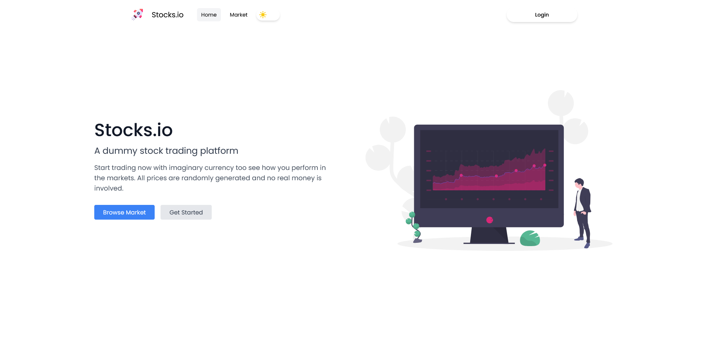
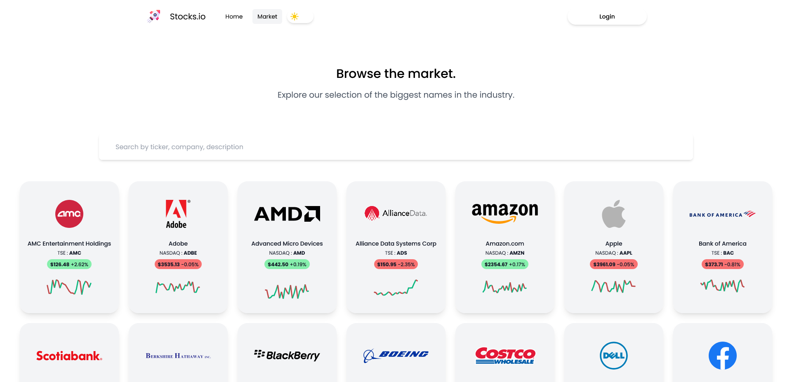
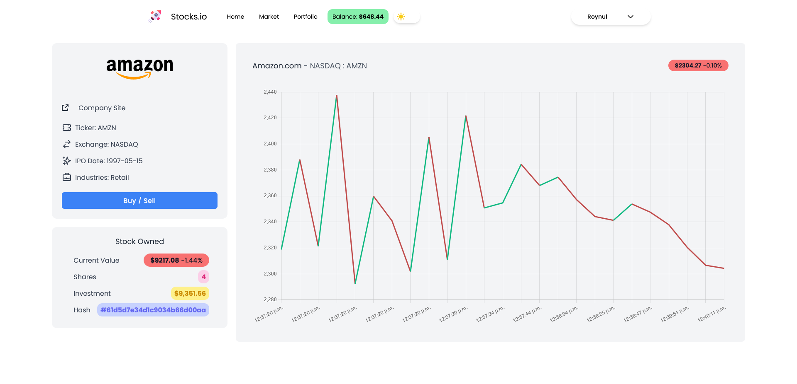
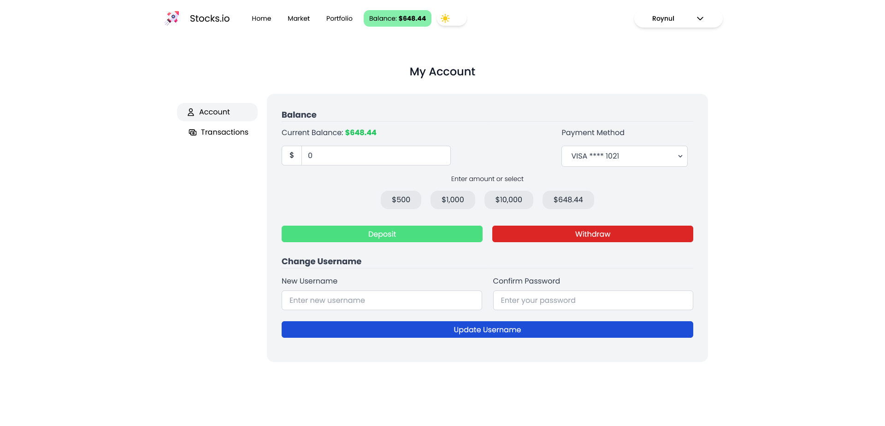

# Stocks<span/>.io Trading Platform

## Overview

Stock<span/>.io is a trading and investment simulation platform developed with the [MERN](https://www.mongodb.com/mern-stack) stack and utilizing [Socket.io](https://socket.io/) for real time price updates. It is only a dummy portfolio project and does not represent real stock values or transactions. This idea for this project was inspired by [Jacky Tea](https://github.com/JackyTea), who created a similar application.

## Table of Contents

- [Stack](#stack)<br/>
- [Data](#data)<br/>
- [Development](#development)<br/>
- [Screenshots](#screenshots)<br/>

## Stack

This project was developed with the MERN stack along with TypeScript, a GraphQL API, Socket.io and JWT for authentication.

**Front-End**

- React
- Redux
- TypeScript
- TailwindCSS, SASS
- Framer-Motion
- Apollo GraphQL Client
- ChartJS

**Back-End**

- Node.js
- Express.js
- TypeScript
- Mongoose
- Apollo GraphQL
- Socket<span/>.io
- JWT

**Database**

- MongoDB Atlas

## Data

The general stock data in this project was generated with [Mockaroo](https://www.mockaroo.com/) and filled in manually.

**Stock**

This project uses [JSON](https://www.json.org/json-en.html) to represent stock data in the form of:

```json
[
  {
    "_id": "ObjectId",
    "ticker": "String",
    "exchange": "String",
    "name": "String",
    "price": 0.00,
    "currency": "String",
    "ipo": "String",
    "country": "String",
    "logo": "URL",
    "weburl": "URL",
  }
]
```

The [schema](https://mongoosejs.com/docs/guide.html) of this model can be found in [`/server/models/Stock.ts`](https://github.com/roynulrohan/Stocks.io/blob/master/server/models/Stock.ts)

## Development

To run this application locally, you will need the following prerequisite programs:

- [Node.JS and NPM](https://nodejs.org/en/)
- [Create React App](https://github.com/facebook/create-react-app)
- [MongoDB Atlas](https://www.mongodb.com/)

**Server Setup**

First, install the necessary packages via:

```
npm i
```

Then, setup the `.env` file in the root of the `/server` directory. (**Note**: this will be gitignored)

```bash
# mongo username
MONGO_USER

# mongo password
MONGO_PASSWORD

# mongo db name
MONGO_DB

# JWT secret
JWT_SECRET

# optional: port
PORT
```

Now you can run the server. Default port is `4000`.

```bash
# start server
node .

# or
npm start
```

**Client Setup**

First, install the necessary packages via:

```
npm i
```

(Optional) Setup the `.env` file in the root of the `/client` directory. (**Note**: this will be gitignored)

```bash
# URI of API server along with the port
# eg. http://localhost:4000
REACT_APP_API_URI
```

Now you can run the clientproject.

```bash
# start react app
npm start
```

## Screenshots

Home Page

Market Page

Stock Page

Account Page
